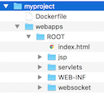

# 使用Docker构建企业级服务器

## 一、背景

传统部署应用的方式是在同一个服务器上部署多个应用程序，这会导致很多麻烦，比如：

1. 当某一个应用程序出错，可能会导致其它的应用程序无法使用。
2. 当部署一个应用程序程序需要重启服务器的时候，同样会导致其它的应用无法使用。而且当部署的应用过多时，启动还很慢。

为此，也有采用虚拟机部署的方式，即一个应用部署在一个虚拟上。但这种方式显然存在以下两方面的问题：

1. 虚拟机会占有过的的硬件资源，导致硬件资源利用了非常低下。通常一台服务器只能十几个虚拟机。
2. 现代大部署企业都选择云服务（比如AWS和阿里云），这种云服务本身就是一个虚拟机。虚拟机中的虚拟机估计没人这么做（盗梦空间：虚拟机中的虚拟机会越来越卡）。

幸运的是，Docker的推出可以解决这一问题。Docker对进程进行了封装隔离，属于操作系统层面上的虚拟机技术。Docker隔离的进程独立与宿主（操作系统）和其它隔离的进程，因此也称其为容器。通俗的讲Docker容器把一切所需要的资源（文件系统、软件和配置等）封装在一个沙盒里面，最终以一个进程的方式在运行。与传统虚拟机技术不同，Docker并不虚拟一套硬件再运行一个完整的操作系统，Docker容器的进程是直接运行在宿主机上的。因此Docker容器是一种轻量级的虚拟化技术，在单机上可以支持上千个Docker容器同时运行。

***注意：本文是从应用的角度来介绍如何使用Docker部署服务器应用程序，并假定读者具有Linux和Docker基础。本文并不打算过多地介绍Docker的概念、原理以及基本操作，关于这些，读者可以参考[Docker — 从入门到实践](https://yeasy.gitbooks.io/docker_practice/content/)和[官方文档](https://docs.docker.com/)。***

## 二、安装

### Mac OS

MacOS可以使用Homebrew 的Cask进行安装：

  ```shell
  brew cask install docker
  ```

然后就可以在应用程序中找到Docker，点击运行即可。

### CentOS

Docker支持 64位版本CentOS 7，并且要求内核版本不低于 3.10。

1. 首先卸载旧版本（如果有）：

  ```shell
  sudo yum remove docker docker-common docker-selinux docker-engine
  ```

2. 安装依赖包：
   
    ```shell
    sudo yum install -y yum-utils device-mapper-persistent-data lvm2
    ```

3. 添加源：

    ```shell
    # 官方源
    sudo yum-config-manager --add-repo https://download.docker.com/linux/centos/docker-ce.repo

    # 国内阿里云的源，如果官方的下载慢可以使用
    sudo yum-config-manager --add-repo https://mirrors.aliyun.com/docker-ce/linux/centos/docker-ce.repo
    ```

4. 安装Docker

  ```shell
  sudo yum makecache fast
  sudo yum install docker-ce
  ```

5. 启动Docker：

  ```shell
  sudo systemctl enable docker
  sudo systemctl start docker
  ```

6. （可选）建立docker 用户组，并将当前用户加入 docker 组（或者创建一个docker用户）：

  ```shell
  sudo groupadd docker
  sudo usermod -aG docker $USER
  ```

更多平台的安装，参考官方的[安装指南](https://docs.docker.com/engine/installation/)。

## 三、服务器部署策略

为应用程序每一个部署的版本都构建一个镜像，并把应用程序构建到镜像里面，而不是通过数据卷的方式共享宿主机上的文件。在必要的时候把容器的日志输出文件挂在到宿主机上。生成的镜像上传到私有镜像服务器上。

**注意**：镜像中并不包含数据库服务器，数据库安装在专门的数据库服务器上，应用程序通过远程连接访问数据库。

这样做的好处有：

1.  做到完全的隔离。一个镜像就是一个完整的应用程序版本，直接从镜像中创建一个容器就可以运行，无需额外配置和操作。
2. 方便部署。不管是部署测试环境还是生产环境，或者需要部署多个服务器，都只需要从镜像服务器pull镜像，然后创建容器就行了。而这些操作都可以由脚本自动完成。
3. 版本管理。为每个发布版本创建一个镜像，当需要回退到某个版本时，直接pull对应的镜像，再创建容器即可。无需从Git中到处版本代码，从新编译。

## 四、定制应用程序部署镜像
### Tomcat

1. 下载官方的[Tomcat镜像](https://hub.docker.com/_/tomcat/)：

  ```shell
  # 下载最新版
  docker pull tomcat

  # java 8
  docker pull tomcat:8.0-jre
  ```

2. 准备工作：
    1. 创建一个空目录（如myproject），之后的操作都在该目录进行。
    2. 把一个需要部署的java项目存储`webapps`（同Tomcat的webapps）目录，项目目录名为`ROOT`（域名根目录访问）或其它名称（域名子目录访问）。
    3. 在`docker`目录创建一个`Dockerfile`文件。
    4. 最终的目录结构如下：

      
           
    **注意**：目录可以自行调整。

3. 编辑`Dockerfile`文件如下：

  ```shell
  FROM tomcat

  RUN rm -rf /usr/local/tomcat/webapps
  COPY webapps /usr/local/tomcat/webapps
  ```

4. 构建镜像：

  ```shell
  docker build -t project_name:version .
  ```

  使用`-t`指定镜像的名称和标签，这里使用`[项目名称]:[版本号]`，用户可以自行定义。

5. 创建容器并运行。

  ```shell
  docker run -d -p 8080:8080 --name project_name_version  project_name:version
  ```
  
或者设置开机自启动：

    ```shell
    docker run -d -p 8080:8080 --restart=always -v  `pwd`/logs:/usr/local/tomcat/logs --        name project_name_version  project_name:version 
    ```

### PHP

待续

### Python

待续

## 五、搭建私有镜像服务器

1. 在服务器创建docker-registry容器：

  ```shell
  sudo docker run -d -p 5000:5000 --restart=always -v /opt/data/registry:/var/lib/registry  --name myregistry  registry
  ```

2. 推送镜像到私有服务器：

  ```shell
  # push the the image to registry
  docker tag project_name:tag server_ip:5000/project_name:tag
  docker push server_ip:5000/project_name:tag
  ```

3. 从私有服务器下载镜像：

  ```shell
  docker pull server_ip:5000/project_name:tag
  ```

## 六、域名和端口绑定
### 使用nginx反向代理

1. 增加一个反向代理配置：

  ```shell
  upstream webserver{
      server 127.0.0.1:8800;
  }

  server {
      listen 80;
      server_name proxy.com;

      location / {
          proxy_pass http://webserver;
      }
  }
  ```
  
2. 在nginx的配置文件include这个配置：

  ```shell
  http {
  
      ...
  
      include /usr/local/etc/nginx/conf/proxy/*;
  }
  ```


### ngrok端口映射

## 七、自动化部署

1. 自动创建镜像并push到私有镜像服务器：

  ```shell
  # bin/bash
  
  tag=1.0
  project_name=name
  server=127.0.0.1:5000

  echo "$project_name:$tag"

  # build a new version of images
  docker build -t $project_name:$tag .

  # stop and remove the old container
  {
      docker stop $project_name
      docker rm $project_name
  } || {
      echo "no container of $project_name"
  }

  # create and run a new container
  docker run -d -p 8080:8080 --restart=always -v `pwd`/logs:/usr/local/tomcat/logs --name $project_name $project_name:$tag

  # push the the image to registry
  docker tag $project_name:$tag $server/$project_name:$tag
  docker push $server/$project_name:$tag
  ```

还可以结合git hook实现自动部署。（待补充）

## 八、图形管理

可以使用[shipyard](https://shipyard-project.com/)基于web的管理端，有两种安装方式：

1. 自动安装
  直接执行`curl -sSL https://shipyard-project.com/deploy | bash -s`。这种安装方式会把宿主机上的8080端口映射到容器shipyard-controller的8080端口。如果宿主机的8080端口已经占用，那么该容器将无法启动，可以删除shipyard-controller容器，在用其它端口手动创建一个（参见手动安装）。
2. 手动安装，执行如下命令：

  ```shell
  docker run -ti -d --restart=always --name shipyard-rethinkdb rethinkdb
  docker run \
    -ti \
    -d \
    -p 4001:4001 \
    -p 7001:7001 \
    --restart=always \
    --name shipyard-discovery \
    microbox/etcd -name discovery

  docker run \
    -ti \
    -d \
    -p 2375:2375 \
    --hostname=$HOSTNAME \
    --restart=always \
    --name shipyard-proxy \
    -v /var/run/docker.sock:/var/run/docker.sock \
    -e PORT=2375 \
    shipyard/docker-proxy:latest

  docker run \
    -ti \
    -d \
    --restart=always \
    --name shipyard-swarm-manager \
    swarm:latest \
    manage --host tcp://0.0.0.0:3375 etcd://<IP-OF-HOST>:4001

  docker run \
    -ti \
    -d \
    --restart=always \
    --name shipyard-swarm-agent \
    swarm:latest \
    join --addr <ip-of-host>:2375 etcd://<ip-of-host>:4001

  # 可以使用-p参数指定端口
  docker run \
    -ti \
    -d \
    --restart=always \
    --name shipyard-controller \
    --link shipyard-rethinkdb:rethinkdb \
    --link shipyard-swarm-manager:swarm \
    -p 8080:8080 \
    shipyard/shipyard:latest \
    server \
    -d tcp://swarm:3375
  ```

安装完成后就可以通过ip:port访问，默认用户名为`admin`，密码`shipyard`。

## 九、结语

本文主要介绍了Docker在实际工程中的应用，分别从安装、定制镜像、私有镜像服务器、域名和端口绑定、自动化部署、图形化管理作了简要说明，最终形成一个可以在企业中应用的Docker平台。

## Ref

* [Docker — 从入门到实践](https://yeasy.gitbooks.io/docker_practice/content/)
* [Docker官方文档](https://docs.docker.com/)
* [shipyard](https://shipyard-project.com/)
