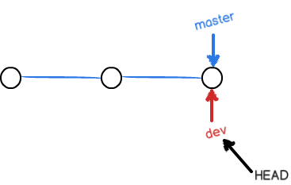
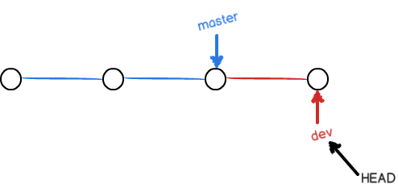
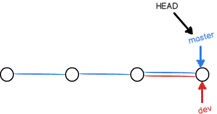

# Git 基础指南

[TOC]

## 1. 版本控制系统（VCS）

  1. 本地版本控制系统。
  2. 集中化的版本控制系统。如Subversion（SVN）。集中式版本控制系统由一个单一的服务器管理软件的版本，所有的人都必须通过这个台服务器取出文件或提交更新。缺点是当服务器出现故障时，那么开发者就没法进行协作了。如果服务器磁盘损坏，那么版本的历史记录将会丢失。
  3. 分布式版本控制系统。如Git。每一个节点都保存了完整的代码创库镜像，同时每一个客户端都可以作为服务器。当服务器出现故障时，可以从任意一个镜像恢复，同时协助也可以继续进行。分布式版本控制系统其实可以不需要一个单独的服务器，服务器的存在只是方便大家访问以及代码的管理。

## 2. Git简史

  1. Git的起源主要时Linux内核开源和维护的需要。
  2. 2002年到2005年，Linux开源组使用BitKeeper（一个专有的分布式版本控制系统）来管理和维护代码。
  3. 2005年BitKeeper收回了Linux内核社区免费使用BitKeeper的权力。
  4. 开源社区需要一个新的版本控制系统，并且需要具备以下几个特点：
        1. 速度。
        2. 简单的设计。
        3. 对非线性开发模式的强力支撑（允许成千上万个并行级开发的分支）。
        4. 完全分布式。
        5. 有能力高效管理类似Linux内核一样的超大规模的项目（速度和数据量）。
  5. Linus Torvalds花了一个星期写出了Git的最初版本。

## 3. Git使用 - 安装

1. 安装Git
  1. Mac、Linux自带Git。
  2. Windows:
     * 从Git官方下载安装。
     * 安装[GitHub for Windows][1]。该安装程序包含图形化和命令行版本的Git。
    **注意**：区分Git和Git图形化客户端。
2. 安装图形化客户端，推荐使用[SourceTree][2]。

## 4. Git使用 - 初次使用的配置

在首次使用Git前需要进行一个配置，定制Git环境。Git自带`git config`命令来帮助设置控制Git的环境。其中最重要的是用户信息，用户信息标识用户的身份，Git在提交时会使用这些信息，提交之后不可更改。

```shell
git config --global user.name "San Zhang"
git config --global user.email sanzhang@example.com
```
使用`git config --list`可以查看当前的配置。

使用`git help xxx`可以获得帮助信息（类似于Linux的`man`命令），如`git help config`。

## 5. Git使用 - 基本操作

1. **创建新创库**。创建或进入一个目录，然后执行`git init`以创建一个新的git创库。这个命令会在当前目录创建一个`.git`的目录，这个目录就是完整的创库镜像。
2. **检查创库**。检查创库使用命令`git clone`：
    1. 从本地创库检查：`git clone /path/to/respository`。
    2. 从远程创库检查：
            1. ssh: `git clone username@host:/path/to/respository`
            2. http/https: `git clone https://github.com/respository_name.git`


## 6. Git使用 - 工作流

git创库包括三个部分：
1. **工作目录**：它持有实际的文件。
2. **暂存区（Index）**：它像一个缓冲区域，临时保存你的改动。
3.  **HEAD**：它指向最后一个提交的结果。


**添加和提交**：
1. 把工作目录的文件添加到暂存区：`git add <finename>` 或者`git add *`。
2. 把暂存区提交到HEAD，`git commit -m "代码提交信息"` 或者`git commit -am "代码提交信息"`。
    ***注意***：提交到HEAD时所有的更新都只保存在本地的镜像中，还没有到远程创库。
3. 推送改动，把本地创库的HEAD提交到远程创库：`git push origin master`，其中`origin`是远程创库名，`master`是分支名称，可以把`master`换成你想要推送的任何分支。当设置了默认推送的分支后，直接使用使用命令`git push`就可以完成推送。

**更新与合并**：
更新本地创库：`git pull`。`pull`命令会从服务器获取（fetch）最新的改动并和本地创库进行合并（merge），git会尝试自动合并改动，当无法自动合并时就会出现冲突（与SVN合并类似），这时就需要手动修改这些冲突。解决冲突后，需要执行如下命令标记合并成功：`git add <filename>`。

## 7. Git使用 - 版本管理

1. 查看工作区的状态， `git status`
2. 查看commit记录，`git log`, 加上参数 `--pretty=oneline`实现每条记录一行显示。
4. 回退版本， `git reset --hard HEAD^`
        参数：`HEAD^`: 表示上一个版本，指定commit ID可以回退到指定版本
6. 撤销修改，`git checkout -- <filename>`, 把<filename>在工作区的修改全部撤销，用版本库的文件替换工作区的文件。
7. 撤销暂存区的修改，`git reset HEAD <filename>`
8.  删除文件，`git rm <filename>`
9. 查看分支合并图，`git log --graph`

## 8. 分支

分支可以看作是一条时间线，SVN通常只有一个分支，看起来像下面这样：


所有的开发者都在同一个分支开发。在开发的过程中可能出现如下问题：

1. 假设开发一个新功能需要两周才能完成，第一周写了50%的代码，由于代码不完整，现在提交会导致别人没法干活。
2. 项目第一期已经发布，第二期也开发了一半。但是发现第一期的代码存在一个严重的漏洞。SVN的解决办法：导出第一期发布的版本，修改代码，然后重复发布。在最新的版本也需要进行一次修改。

Git的分支可以完美解决这类问题。在创建Git创库时会创建一个默认的分支`master`，也称主分支。只有`master`分支的Git创库看起来和SVN差不多。


Git可以创建一个新的分支（比如dev），然后把HEAD指向新分支，如下图：



这时对工作区的修改和提交就针对dev分支了，`master`分支不变。



当`dev`分支开发完成了，就可以把`dev`合并到`master`上：



当项目结束后，还可以删除`dev`分支，只剩下`master`分支。


***注意***：在一个Git创库中，`master`分支通常指向稳定的版本，而开发在`dev`分支上进行。

**分支命令**：

1. 创建并切换到分支：`git checkout -b <branch_name>`，这个命令实际执行了两个命令：
   
    ```shell
    git branch <branch_name>      # 创建分支branch_name
    git checkout <bracnch_name> # 切换草branch_name分支
    ```
2. 列出所有的分支：`git branch`
3. 合并分支，把`dev`分支合并到`master`分支：
    
    ```shell
    git checkout master    # 切换到主分支
    git merge dev             # 把dev合并到master
    ```

4. 删除分支：`git branch -d <branch_name>`；强行删除分支：`git branch -D <branch_name>`。
5. 推送本地分支到远程创库：`git push origin <branch_name>`
6. 创建本地分支并与远程分支建立链接：`git checkout -b <branch_name> origin/<branch_name>`
7. 设置本地分支与远程分支的链接：`git branch --set-upstream <branch_name> origin/<branch_name>`
8. 从远程创库更新分支：`git pull`

## 9. 分支管理策略
在实际开发中，我们应该按照几个基本原则进行分支管理：

1. `master`分支应该是非常稳定的，也就是仅用来发布新的版本，平时不在上面开发。
2. `dev`用于开发，`dev`分支是不稳定的，当开发完成一个版本时（比如1.0版本），把`dev`合并到`master`。
3. 每个开发中在`dev`分支建立自己的开发分支（如`dev-zcl`），在自己的开发分支上开发，时不时往`dev`分支合并就可以了,，自己的开发分支只保存在开发中自己的电脑，不需要提交到服务器的创库。
4. 团队合作的分支看起来像这样：


## 10. 标签 tag

发布版本时，通常也在版本库中打一个标签（tag），标签是版本库中的一个快照，方便以后取出这个版本。

1. 创建标签， `git tag <tag_name>` 为当前提交打标签，添加commit id可以为历史提交版本打标签。带说明的标签，`git tag -a <tag_name> -m 'des' ID`。
2. 查看标签，`git tag`
3. 查看标签详情， `git show <tag_name>`
4. 删除标签，`git tag -d <tag_name>`
5. 推送标签到远程, `git push origin <tag_name>`
6. 推送全部标签，`git push origin --tags`
7. 删除远程标签:
    
    ```shell
    git tag -d <tag_name>
    git push origin :refs/tags/<tag_name>
    ```

## 11. Git服务器

* [GitHub][3]
* [Gitlab][4]
* [Gogs][5]

## 12. Git免密码登陆
使用ssh协议可以实现免密码登陆，实现创库clone和push等操作。

1. 生成秘钥。Mac/Linux使用终端，Windows使用Git Bash，执行命令：

```shell
ssh-keygen -t rsa -C "your.email@example" -b 4096
```

上面的命令会生成一个密钥对，保存在~/.ssh。

2. 把`id_rsa.pub`文件内容拷贝到Git服务器，具体参考不同服务器的说明。

## 13. Git钩子
Git钩子能在特点的动作发生时触发自定义脚本，钩子都被存在Git目录下的`hooks`子目录中，在初始化创库的时候就会创建这个目录，并且会创建一些示例脚本。钩子的脚本可以使用任何可执行的脚本语言编写，比如shell、Python、Ruby和Perl等。

Git钩子包括客户端和服务器钩子。客户端钩子分为三种：提交工作流钩子、电子邮件工作流钩子和其它钩子。
1. 提交工作流钩子：
    `pre-commit`钩子在键入提交信息前运行。它用于检查即将提交的快照，例如，检查是否有所遗漏，确保测试运行，以及核查代码。 如果该钩子以非零值退出，Git 将放弃此次提交。
    `prepare-commit-msg`钩子在启动提交信息编辑器之前，默认信息被创建之后运行。 
    `commit-msg`钩子接收一个参数，此参数即上文提到的，存有当前提交信息的临时文件的路径。 如果该钩子脚本以非零值退出，Git 将放弃提交，因此，可以用来在提交通过前验证项目状态或提交信息。 
    `post-commit`钩子在整个提交过程完成后运行

2. 电子邮件工作流钩子

3. 其它客户端钩子
    `pre-rebase`钩子运行于变基之前，以非零值退出可以中止变基的过程。
    `post-rewrite` 钩子被那些会替换提交记录的命令调用.
    在`git checkout`成功运行后，`post-checkout`钩子会被调用。你可以根据你的项目环境用它调整你的工作目录。 
    在`git merge`成功运行后，`post-merge` 钩子会被调用。
    `pre-push`钩子会在`git push`运行期间， 更新了远程引用但尚未传送对象时被调用。 

系统管理员可以使用若干服务器端的钩子对项目强制执行各种类型的策略。 这些钩子脚本在推送到服务器之前和之后运行。 推送到服务器前运行的钩子可以在任何时候以非零值退出，拒绝推送并给客户端返回错误消息，还可以依你所想设置足够复杂的推送策略。
    1. `pre-receive`：处理来自客户端的推送操作时，最先被调用的脚本是 pre-receive。
    2. `update`：`update`脚本和`pre-receive`脚本十分类似，不同之处在于它会为每一个准备更新的分支各运行一次。 假如推送者同时向多个分支推送内容，pre-receive 只运行一次，相比之下 update 则会为每一个被推送的分支各运行一次。 
    3. `post-receive`：`post-receive`挂钩在整个过程完结以后运行，可以用来更新其他系统服务或者通知用户，可以用于自动发布。

## 14. GitHub
[GitHub]()是一个远程创库服务器，也是一个开源社区，通过GitHub，既可以参与别人的项目，也可以让别人参与你的项目。GitHub的使用：

1. 注册账号。
2. 设置ssh密钥（可选）。
3. 创建项目或者`Fork`别人的项目。
4. `git clone git@github.com/xxxx.git`
5. `push`项目。
6. 如果是`Fork`别人的项目，还可以发起一个`pull request`向对方贡献代码。当然，对方是否接受你的`pull request`就不一定。

## 15. 从SVN到Git
Git还提供SVN的桥接工具`git svn`。使用方法：

1. 检出创库：`git svn clone --username <username> http://svnserver/project/trunk`。
2. 检出之后就会得到一个Git创库镜像，可以使用`git add`和`git commit`等命令。
3. 提交代码到SVN服务：`git svn dcommit`，**不是**`push`。
4. 同步远程svn服务器：`git svn rebase`。

## Ref

* [git - 简明指南][6]
* [Git教程 - 廖雪峰的官方网站][7]
* [Git官方Book][8]

[1]: https://desktop.github.com/ 
[2]: https://www.sourcetreeapp.com/         
[3]: https://github.com/ 
[4]:https://about.gitlab.com/ 
[5]: https://gogs.io/ 
[6]: http://rogerdudler.github.io/git-guide/index.zh.html 
[7]: https://www.liaoxuefeng.com/wiki/0013739516305929606dd18361248578c67b8067c8c017b000
[8]: https://git-scm.com/book/zh/v2 
